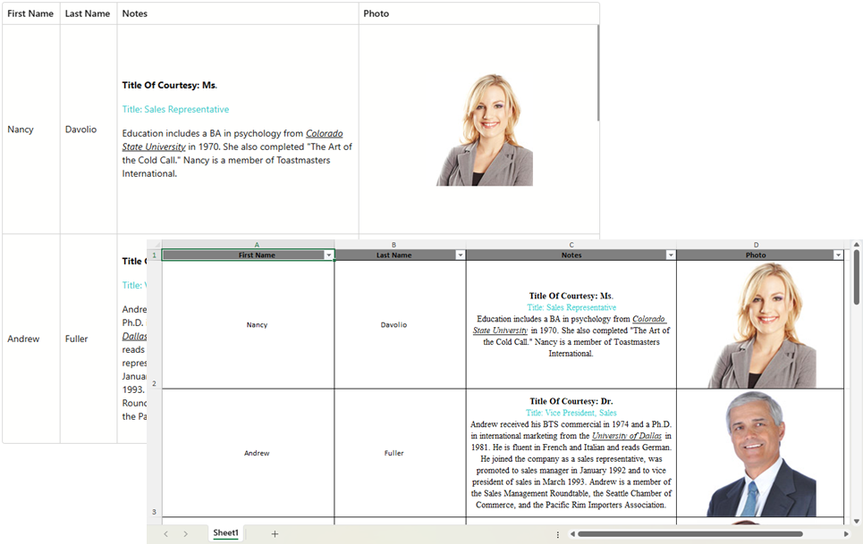

<!-- default badges list -->

<!-- default badges end -->
# Blazor Grid - Export Images/Rich Text Using Spreadsheet Document APIs

The DevExpress Blazor Grid ships with [built-in methods](https://docs.devexpress.com/Blazor/404338/components/grid/export) designed to export Grid data to a spreadsheet file. You should use the manual implementation described below when using cell templates (common data types requiring the use of cell templates are rich text and images). To export rich text/image content, you need to transfer data to spreadsheet cells manually.

> [!IMPORTANT]
> This example uses the [DevExpress Office File API](https://docs.devexpress.com/Blazor/404576/components/office-file-api) - a standalone library that allows you to read/write documents, spreadsheets, presentations, and PDF files. The DevExpress Office File API is included in the following subscriptions: [DevExpress Office File API Subscription](https://www.devexpress.com/products/net/office-file-api/) or [DevExpress Universal Subscription](https://www.devexpress.com/subscriptions/universal.xml).

## Implementation Details

### Set Up Your Grid

Add a DevExpress Blazor Grid and populate it with data. Use [CellDisplayTemplate](https://docs.devexpress.com/Blazor/DevExpress.Blazor.DxGridDataColumn.CellDisplayTemplate) to display [images](./CS/ExportImagesAndRichText/Components/Pages/Index.razor#L43)/[rich text](./CS/ExportImagesAndRichText/Components/Pages/Index.razor#L35) within cells.

### Implement an Export Engine

To export image/rich text, you must:

1. Create a [Workbook](https://docs.devexpress.com/OfficeFileAPI/DevExpress.Spreadsheet.Workbook) instance and access the active worksheet.
1. Iterate through Grid data columns (using the [GetVisibleColumns](https://docs.devexpress.com/Blazor/DevExpress.Blazor.DxGrid.GetVisibleColumns) method) and create corresponding header cells in the worksheet. You can call [BeginUpdateFormatting](https://docs.devexpress.com/OfficeFileAPI/DevExpress.Spreadsheet.CellRange.BeginUpdateFormatting?p=netframework) and [EndUpdateFormatting](https://docs.devexpress.com/OfficeFileAPI/DevExpress.Spreadsheet.CellRange.EndUpdateFormatting(DevExpress.Spreadsheet.Formatting)) methods to apply header formatting.
1. Call [DxGrid.GetVisibleRowCount](https://docs.devexpress.com/Blazor/DevExpress.Blazor.DxGrid.GetVisibleRowCount) and [DxGrid.GetRowValue](https://docs.devexpress.com/Blazor/DevExpress.Blazor.DxGrid.GetRowValue(System.Int32-System.String)) methods to iterate through visible rows and obtain cell values from each row. 
1. Populate the worksheet with cell values using the [SetValue](https://docs.devexpress.com/OfficeFileAPI/DevExpress.Spreadsheet.CellRange.SetValue(System.Object)?p=netframework) method. 
1. _Optional._ Create a [table](https://docs.devexpress.com/OfficeFileAPI/403308/spreadsheet-document-api/spreadsheet-tables#create-a-table) to enable data filter and sorting options in the exported document.
1. Call the [SaveDocument{Async}](https://docs.devexpress.com/OfficeFileAPI/DevExpress.Spreadsheet.Workbook.SaveDocument.overloads?p=netframework)/[ExportToPdf{Async}](https://docs.devexpress.com/OfficeFileAPI/DevExpress.Spreadsheet.Workbook.ExportToPdf.overloads) method to export the generated document. 
1. _Optional._ Specify [PrintOptions](https://docs.devexpress.com/OfficeFileAPI/DevExpress.Spreadsheet.Worksheet.PrintOptions?p=netframework) to customize document appearance.

## Files to Review

* [Index.razor](https://github.com/DevExpress-Examples/blazor-grid-how-to-export-images-and-rich-text-using-spreadsheet-document-api/blob/25.1.0%2B/CS/ExportImagesAndRichText/Components/Pages/Index.razor)
* [CustomDocumentVisitor.cs](https://github.com/DevExpress-Examples/blazor-grid-how-to-export-images-and-rich-text-using-spreadsheet-document-api/blob/25.1.0%2B/CS/ExportImagesAndRichText/Models/CustomDocumentVisitor.cs)

## Documentation

- [Spreadsheet Document API Examples](https://docs.devexpress.com/OfficeFileAPI/12074/spreadsheet-document-api/examples)
- [Blazor Grid](https://docs.devexpress.com/Blazor/403143/components/grid)

<!-- feedback -->
## Does this example address your development requirements/objectives?

 

(you will be redirected to DevExpress.com to submit your response)
<!-- feedback end -->

